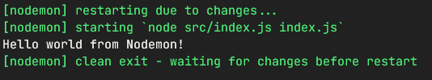

# Fundamentos do Node.js e Jest
Instrutora: Nathally Souza

Criaremos um server de teste com uso do `Node` e `Jest` para testes automatizados

## 1. Criando o servidor
### a) Inicializando o servidor
- Começaremos criando o servidor, sendo necessário instalar o NodeJS e criar o diretório do projeto
- No terminal, dentro do diretório do projeto, executamos o comando `npm init` para criar o arquivo *package.JSON*
- Instalamos o `nodemon` como dependência do projeto
  - Como se trata de um módulo para uso apenas local, podemos instalar com o comando `npm install --save-dev nodemon`
  - Isso instalará o *nodemon* como devDependency, isto é, que não será usado no ambiente de produção
- Criamos um arquivo base index.js para ser executado
  ```javascript
  function welcome() {
    console.log("Hello world!")
  }

  welcome()
  ```
- Criamos um script para inicializar o servidor no arquivo package.json:
  ```javascript
  [...]
    "scripts": {
    "dev": "nodemon src/index.js",
    "test": "echo \"Error: no test specified\" && exit 1"
  }
  [...]
  ```
- No terminal, iniciamos o servidor com o script criado, através do comando `npm run dev`, e veremos a saída do comando - "Hello world"
- Como estamos com o `nodemon` rodando, ao alterarmos o código, veremos a atualização instantânea.
- Mudando a linha do arquivo *index.js* para `console.log("Hello world from Nodemon")`, veremos a nova mensagem impressa na tela instantaneamento ao salvarmos a mudança no arquivo, ao invés da mensagem original "Hello world!")

- Para continuar o desenvolvimento do servidor, instalaremos o `express` com o comando `npm install express`
- Configuramos o express no arquivo *index.js*, refatorando-seu código:
  ```javascript
  import express from 'express'

  const server = express();

  server.listen(5000, () => {
    console.log('Servidor on na porta 5000')
  })
  ```
- Uma vez que usamos a sintaxe ES6 para importação de módulos `import express from 'express';`, deveremos comunicar isso ao *package.json*, acresentando a propriedade `"type": "module"`:
  ```javascript
  {
    "name": "node-and-jest",
    "version": "1.0.0",
    "description": "Made for DIO Impuls JS 2022 bootcamp",
    "main": "index.js",
    "type": "module",
      "scripts": {
      "dev": "nodemon src/index.js",
      "test": "echo \"Error: no test specified\" && exit 1"
    },
    "keywords": [
      "node;jest;dio;impulso"
    ],
    "author": "Pitossomo",
    "license": "ISC",
    "devDependencies": {
      "nodemon": "^2.0.19"
    },
    "dependencies": {
      "express": "^4.18.1"
    }
  }
  ```
