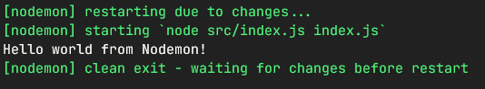
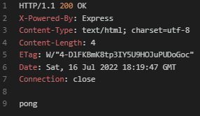
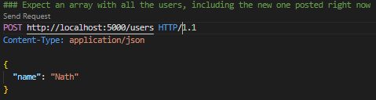
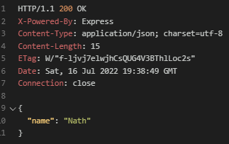
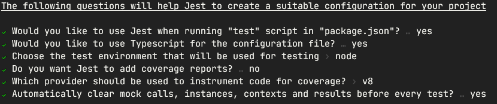

# Fundamentos do Node.js e Jest
Instrutora: Nathally Souza

Criaremos um server de teste com uso do `Node` e `Jest` para testes automatizados

## 1. Criando o servidor
### a) Inicializando o servidor
- Começaremos criando o servidor, sendo necessário instalar o NodeJS e criar o diretório do projeto
- No terminal, dentro do diretório do projeto, executamos o comando `npm init` para criar o arquivo *package.JSON*
- Instalamos o `nodemon` com o comando `npm install nodemon`
- Criamos o diretório *src/* com um arquivo base *src/index.js* para ser executado
  ```javascript
  function welcome() {
    console.log("Hello world!")
  }

  welcome()
  ```
- Criamos um script para inicializar o servidor no arquivo package.json:
  ```javascript
  [...]
    "scripts": {
    "start": "nodemon src/index.js",
    "test": "echo \"Error: no test specified\" && exit 1"
  }
  [...]
  ```
- No terminal, iniciamos o servidor com o script criado, através do comando `npm start`, e veremos a saída do comando - "Hello world"
- Como estamos com o `nodemon` rodando, ao alterarmos o código, veremos a atualização instantânea.
- Mudando a linha do arquivo *index.js* para `console.log("Hello world from Nodemon")`, veremos a nova mensagem impressa na tela instantaneamento ao salvarmos a mudança no arquivo, ao invés da mensagem original "Hello world!")

- Para continuar o desenvolvimento do servidor, instalaremos o `express` com o comando `npm install express`
- Configuramos o express no arquivo *index.js*, refatorando-seu código:
  ```javascript
  import express from 'express'

  const server = express();

  server.listen(5000, () => {
    console.log('Servidor online na porta 5000')
  })
  ```
- Uma vez que usamos a sintaxe ES6 para importação de módulos `import express from 'express';`, deveremos comunicar isso ao *package.json*, acresentando a propriedade `"type": "module"`:
  ```javascript
  {
    "name": "node-and-jest",
    "version": "1.0.0",
    "description": "Made for DIO Impuls JS 2022 bootcamp",
    "main": "index.js",
    "type": "module",
      "scripts": {
      "start": "nodemon src/index.js",
      "test": "echo \"Error: no test specified\" && exit 1"
    },
    "keywords": [
      "node;jest;dio;impulso"
    ],
    "author": "Pitossomo",
    "license": "ISC",
    "dependencies": {
      "express": "^4.18.1",
      "nodemon": "^2.0.19"
    }
  }
  ```

### b) Criando as rotas com Express
- Criaremos o arquivo *src/routes.js* importando e instanciando o Router do express para gerir as rotas
  ```javascript
  import { Router } from 'express'

  const routes = Router()

  //TODO

  export { routes }
  ```
- Nossas rotas poderão lidar com os métodos HTTP:
  - GET - Ler os dados do backend
  - POST - Criar dados
  - PUT/PATCH - Alterar dados
  - DELETE - Remover dados
- As respostas às requisições do usuário deverão retornar códigos de status, por exemplo:
  - 200 - Requisição bem sucedida
  - 201 - Dados criados com sucesso
  - 404 - Página não encontrada
-  o arquivo *src/routes.js* com as rotas, p. ex.:
```javascript
  [...]
  routes.get('/ping', (request, response) => {
    return response.status(200).send("pong") 
  })

  routes.get('/users', (request, response) => {
    return response.status(200).json(database) 
  })
  [...]
```
- Importamos e usamos as rotas no arquivo *index.js*:
```javascript
  import express from 'express'
  import { routes } from './routes.js';

  const server = express();
  server.use(routes); 

  server.listen(5000, () => {
    console.log('Servidor on na porta 5000')
  })
```
- Podemos testar nossas rotas fazendo requisições, por meio de uma extensão do VSCode como a [RestClient](https://marketplace.visualstudio.com/items?itemName=humao.rest-client)
- Por exemplo:
  - a seguinte requisição:
    - 
  - produzirá a seguinte resposta:
    - 
- Já criamos uma rota para retornar os usuários na database, que foi inicializada como uma array vazia
- Podemos adicionar uma rota para criarmos novos dados com o método POST
- MAS, antes disso, devemos configurar o *express* para lermos arquivos *JSON*, no arquivo *index.js*:
```javascript
  [...]
  const server = express();
  server.use(express.json())
  server.use(routes); 
  [...]
```
- Importante observarmos a ordem 
  - a nova instrução `server.use(express.json())`deve vir antes de `server.use(routes)` 
  - devemos configurar o app para que ele possa ler arquivos JSON antes do Router ser instanciado
- Agora sim criamos nossa nova rota para o método POST:
```javascript
  [...]
  routes.post('/users', (request, response) => {
    const { name } = request.body   // Get the name from request's body content, which should be a new user (although we did not validated it yet)   
    database.push(name)             // Put the new user on the database
    return response.status(201).json({'message': `Usuário ${name} criado`})  // Return the saved user name as the response
  })
  [...]
```
- Realizando o teste manual:
  - a seguinte requisição:
    - 
  - terá a seguinte resposta:
    - 

### c) Validações
- Com o nosso método POST criado, podemos melhorá-lo validando os dados de entrada
- Rejeitaremos novos usuários com nome em branco ou cujo nome já exista no banco de dados:
  ```javascript
    [...]
    // Validations
    if (!name || name.length < 1) return response.status(403).json({message: `Não é possível criar usuário sem nome`});
    if (database.some( el => el.toLowercase() === name.toLowercase())) {
      return (response.status(403).json({message: `O nome de usuário já existe no banco de dados`}))
    }
    [...]
  ```
- O código para lidarmos com o método POST se alongou demais, e há o risco de, ao alterá-lo, quebrarmos a rota.
- Iremos, portanto, criar um controlador *usersController.js* para realizar a manipulação da requisição
- Isso obedece ao modelo MVC de desenvolvimento, que prega a segregação das funções de:
  - *Model*, ou modelagem e acesso ao banco de dados
  - *View*, ou visualização das informações
  - *Controller*, ou controle e manipulação dos dados
- No *controller*, também colocaremos a função getAllUsers para lidar com a requisição GET para o endpoint `/users` 
- Nosso arquivo *usersController.js* ficará assim:
  ```javascript
  import userDatabase from "../model/usersDatabase.js";

  const usersController = {
    getAllUsers (request, response) {
      return response.status(200).json(userDatabase) 
    },
    
    createUser (request, response) {
      const { name } = request.body   // Get the name from request's body content, which should be a new user (although we did not validated it yet)   
    
      // Validations
      // Reject empty name
      if (!name || name.length < 1) return response.status(403).json({message: `Não é possível criar usuário sem nome`});
      // Reject already existing name
      if (userDatabase.some(el => el.toLowerCase() === name.toLowerCase())) {
        return (response.status(403).json({message: `O nome de usuário já existe no banco de dados`}))
      }
        
      userDatabase.push(name)             // Put the new user on the database
      return response.status(201).json({message: `Usuário ${name} criado`})  // Return the saved user name as the response
    }
  }

  export { usersController }
  ```
- Por sua vez, o arquivo *routes.js* será simplificado:
  ```javascript
  import { Router } from 'express'
  import { usersController } from './controllers/usersController.js'
  import userDatabase from './model/usersDatabase.js'

  const routes = Router()

  routes.get('/users', usersController.getAllUsers)

  routes.get('/users', (request, response) => {
    return response.status(200).json(userDatabase) 
  })

  routes.post('/users', usersController.createUser)

  export { routes }
  ```
- Importante destacar que separamos a base de dados em outro arquivo, *src/model/usersDatabase.js*, conforme dita o padrão MVC

## 2. Implementando o Typescript
### a) Configurando o Typescript
- Instalamos o typescript com o comando `npm install --save-dev typescript`
- Inicializamos o typescript no projeto com o comando `npx tsc --init`
- Instalaremos ainda o *ts-node-dev* com o comando `npm install --save-dev ts-node-dev`, que compila e executa o código Typescript diretamente sem precisarmos fazer as duas etapas separadamente por conta própria
- Iniciando a refatoração pelo *index.js*, que passará a ser chamar *index.ts*, veremos um alerta para instalarmos o *@types/express*, o qual faremos pelo comando `npm i --save-dev @types/express`  
- Criamos um script `"start": "ts-node-dev src/index.ts` para inicializar o projeto
- Será necessário comentarmos por ora as linhas que fazem referência ao arquivo *routes.js* 
- Em caso de bug, podemos remover a propriedade `"type": "module"` do package-json, bem como remover o arquivo *package-lock.json* ou o diretório *node_modules* e reinstalar os pacotes com o comando `npm install`
- Também pode ser preciso reiniciar o VSCode
- Nosso *package.json* atualizado será:
  ```javascript
  {
    "name": "node-and-jest",
    "version": "1.0.0",
    "description": "Made for DIO Impuls JS 2022 bootcamp",
    "main": "index.js",
    "scripts": {
      "start": "nodemon src/index.js",
      "dev": "ts-node-dev src/index.ts",
      "test": "echo \"Error: no test specified\" && exit 1"
    },
    "keywords": [
      "node;jest;dio;impulso"
    ],
    "author": "Pitossomo",
    "license": "ISC",
    "devDependencies": {
      "@types/express": "^4.17.13",
      "ts-node-dev": "^2.0.0",
      "typescript": "^4.7.4"
    },
    "dependencies": {
      "nodemon": "^2.0.19",
      "express": "^4.18.1"
    }
  }
  ```
- Por enquanto, o arquivo *index.ts* ficará assim:
  ```javascript
  import express from 'express';
  // import { routes } from "./routes.js"

  const server = express();
  server.use(express.json());
  // server.use(routes)

  server.listen(5000, () => {
    console.log('Servidor on na porta 5000')
  });
  ```

### b) Refatorando o código
- No arquivo *usersDatabase.js*, que passará a ser *usersDatabase.ts*, precisaremos informar o tipo da array, que será uma array de strings:
  ```typescript
  const userDatabase: string[] = []

  export default userDatabase
  ```
- No arquivo *userController.js*, que passará a ser *userController.ts*, teremos algum trabalho:
  - Usaremos a sintaxe de classe para o UsersController, que anteriormente era apenas um objeto
  - Importaremos os tipos Request e Response do express, que serão usados na definição das funções e dos parâmetros
  - Removeremos a extensão *.ts das importações
  - Nosso código ficará assim:
  ```typescript
  import { Request, Response } from "express";
  import userDatabase from "../model/usersDatabase";

  export class UsersController {
    getAllUsers (request: Request, response: Response): Response {
      return response.status(200).json(userDatabase) 
    }

    createUser (request: Request, response: Response): Response {
      const { name } = request.body   // Get the name from request's body content, which should be a new user (although we did not validated it yet)   
    
      // Validations
      // Reject empty name
      if (!name || name.length < 1) return response.status(403).json({message: `Não é possível criar usuário sem nome`});
      // Reject already existing name
      if (userDatabase.some(el => el.toLowerCase() === name.toLowerCase())) {
        return (response.status(403).json({message: `O nome de usuário já existe no banco de dados`}))
      }
        
      userDatabase.push(name)             // Put the new user on the database
      return response.status(201).json({message: `Usuário ${name} criado`})  // Return the saved user name as the response
    }
  }
  ```
- No arquivo *routes.js*, que passará a ser *routes.ts*, devemos instanciar a nova classe UsersController e corrigir sua importação:
  ```typescript
  import { Router } from 'express'
  import { UsersController } from './controllers/usersController'

  const routes = Router()
  const usersController = new UsersController()

  routes.get('/ping', (request, response) => {
    return response.status(200).send("pong") 
  })

  routes.get('/users', usersController.getAllUsers)

  routes.post('/users', usersController.createUser)

  export { routes }
  ```
- No arquivo *index.ts*, podemos retirar dos comentários as referências ao *routes.ts* e corrigir sua importação, o que deverá fazer nosso código rodar perfeitamente ao inicializarmos o servidor com o comando `npm run dev`
- Com nosso código mais uma vez funcionando, poderemos  fazer as requisições manuais para testarmos, com os mesmos resultados anteriores.

## 3. Configurando o JEST
- Ao implementar o Jest na nossa aplicação, facilitaremos os testes unitários, que serão automatizados e não mais manuais como temos feito
- Para isso, instalaremos o pacote e seus tipos com o comando `npm install --save-dev jest @types/jest`
- Executaremos também o comando `npm install --save-dev ts-jest` para usarmos o *jest* e o *Typescript* juntos
- A instrutora sugere ainda instalarmos a extensão do [Jest Runner](https://marketplace.visualstudio.com/items?itemName=firsttris.vscode-jest-runner) do VSCode para rodar os testes diretamente do código
- Iniciamos o *jest* no projeto com o comando `npx jest --init` com as seguintes opções:
  - 
- O arquivo *jest.config.ts* será criado na raíz da aplicação, e deveremos configurá-lo:
  - descomentando a propriedade `testMatch` para indicar quais arquivos serão usados como arquivos de teste:
    ```javascript
    [...]
    // The glob patterns Jest uses to detect test files
    testMatch: [
      "**/__tests__/**/*.[jt]s?(x)",
      "**/?(*.)+(spec|test).[tj]s?(x)"
    ],
    [...]
    ```
  - definindo a propriedade `preset = 'ts-jest'` no arquivo *jest.config.ts*
    ```javascript
    [...]
    // A preset that is used as a base for Jest's configuration
    preset: 'ts-jest',
    [...]
    ```

- Na pasta *controllers*, criaremos o arquivo *usersController.ts* para os testes da classe em questão, e poderemos criar nosso primeiro teste como exemplo:
  ```javascript
  describe('Users Controller', () => {
    it('deve somar 1+1', () => {
      expect(1+1).toBe(2)
    })
  })
  ```

## 4. Padrão AAA
- Padrão usado para criar testes unitários
- Padrão AAA ou Triplo A
  - Arrange - Montagem do cenário de testes
  - Act - Ação que será testada
  - Assert - Validação dos resultados esperados
- Podemos refatorar nosso teste anterior para o padrão AAA:
  ```typescript
  describe('Users Controller', () => {
    it('deve somar 1+1', () => {
      const sum = (a:number, b: number):number => a+b // Arrange
      const result = sum(1,1) // Act     
      expect(result).toBe(2) // Assert
    })
  })
  ```

## 5. Mocks e Testes Unitários
### a) Criando mocks e testes unitários
- Conceitos:
  - Mock
    - objeto que susbtitui implementações reais em um cenário de testes unitários
    - permite isolar e validar apenas comportamentos específicos
  - Teste unitário
    - Tipo mais simples de teste da aplicação
    - Testa apenas um componente, função ou funcionalidade específica
- A instrutora forneceu o arquivo *mockResponse.ts*, que ficará na pasta *src/mocks/* e será usado nos testes a serem desenvolvidos:
  ```typescript
  import { Response } from 'express'

  export type MockResponse<TResult> = Response & {
      state: {
        status?: number;
        json?: TResult | unknown;
      }
    }

  export function makeMockResponse<TResult> () {
    const response = {
      state: {
      }
    } as MockResponse<TResult>

    response.status = (status: number) => {
      response.state.status = status
      return response
    }

    response.json = (json: TResult) => {
      response.state.json = json
      return response
    }

    return response
  }
  ```
- Testaremos a classe UserController, cujos métodos recebem dois parâmetros, sendo um do tipo Request e outro do tipo Response
- O código fornecido facilita a criação de uma variável tipo *Response* do express, por meio da função `makeMockResponse`, para ser usada como parâmetro
- A variável do tipo Request será criado no próprio arquivo de testes
- Colocaremos alguns usuários iniciais no nosso arquivo *userDatabase.ts*
  ```javascript
  const userDatabase: string[] = ['Felipe', 'Nathy', 'Haruo', 'Adriana']
  export default userDatabase
  ```
- Criaremos um novo teste no arquivo *usersController.test.ts*
