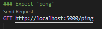
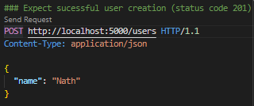
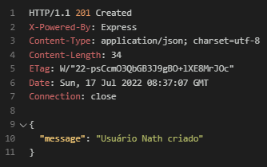

# Fundamentos do Node.js e Jest
Instrutora: Nathally Souza

Criaremos um server de teste com uso do `Node` e `Jest` para testes automatizados

## 1. Criando o servidor
### a) Inicializando o servidor
- Começaremos criando o servidor, sendo necessário instalar o NodeJS e criar o diretório do projeto
- No terminal, dentro do diretório do projeto, executamos o comando `npm init` para criar o arquivo *package.JSON*
- Instalamos o `nodemon` como dependência do projeto
  - Como se trata de um módulo para uso apenas local, podemos instalar com o comando `npm install --save-dev nodemon`
  - Isso instalará o *nodemon* como devDependency, isto é, que não será usado no ambiente de produção
- Criamos o diretório *src/* com um arquivo base *src/index.js* para ser executado
  ```javascript
  function welcome() {
    console.log("Hello world!")
  }

  welcome()
  ```
- Criamos um script para inicializar o servidor no arquivo package.json:
  ```javascript
  [...]
    "scripts": {
    "dev": "nodemon src/index.js",
    "test": "echo \"Error: no test specified\" && exit 1"
  }
  [...]
  ```
- No terminal, iniciamos o servidor com o script criado, através do comando `npm run dev`, e veremos a saída do comando - "Hello world"
- Como estamos com o `nodemon` rodando, ao alterarmos o código, veremos a atualização instantânea.
- Mudando a linha do arquivo *index.js* para `console.log("Hello world from Nodemon")`, veremos a nova mensagem impressa na tela instantaneamento ao salvarmos a mudança no arquivo, ao invés da mensagem original "Hello world!")

- Para continuar o desenvolvimento do servidor, instalaremos o `express` com o comando `npm install express`
- Configuramos o express no arquivo *index.js*, refatorando-seu código:
  ```javascript
  import express from 'express'

  const server = express();

  server.listen(5000, () => {
    console.log('Servidor online na porta 5000')
  })
  ```
- Uma vez que usamos a sintaxe ES6 para importação de módulos `import express from 'express';`, deveremos comunicar isso ao *package.json*, acresentando a propriedade `"type": "module"`:
  ```javascript
  {
    "name": "node-and-jest",
    "version": "1.0.0",
    "description": "Made for DIO Impuls JS 2022 bootcamp",
    "main": "index.js",
    "type": "module",
      "scripts": {
      "dev": "nodemon src/index.js",
      "test": "echo \"Error: no test specified\" && exit 1"
    },
    "keywords": [
      "node;jest;dio;impulso"
    ],
    "author": "Pitossomo",
    "license": "ISC",
    "devDependencies": {
      "nodemon": "^2.0.19"
    },
    "dependencies": {
      "express": "^4.18.1"
    }
  }
  ```

### b) Criando as rotas com Express
- Criaremos o arquivo *src/routes.js* importando e instanciando o Router do express para gerir as rotas
  ```javascript
  import { Router } from 'express'

  const routes = Router()

  //TODO

  export { routes }
  ```
- Nossas rotas poderão lidar com os métodos HTTP:
  - GET - Ler os dados do backend
  - POST - Criar dados
  - PUT/PATCH - Alterar dados
  - DELETE - Remover dados
- As respostas às requisições do usuário deverão retornar códigos de status, por exemplo:
  - 200 - Requisição bem sucedida
  - 201 - Dados criados com sucesso
  - 404 - Página não encontrada
-  o arquivo *src/routes.js* com as rotas, p. ex.:
```javascript
  [...]
  routes.get('/ping', (request, response) => {
    return response.status(200).send("pong") 
  })

  routes.get('/users', (request, response) => {
    return response.status(200).json(database) 
  })
  [...]
```
- Importamos e usamos as rotas no arquivo *index.js*:
```javascript
  import express from 'express'
  import { routes } from './routes.js';

  const server = express();
  server.use(routes); 

  server.listen(5000, () => {
    console.log('Servidor on na porta 5000')
  })
```
- Podemos testar nossas rotas fazendo requisições, por meio de uma extensão do VSCode como a [RestClient](https://marketplace.visualstudio.com/items?itemName=humao.rest-client)
- Por exemplo:
  - a seguinte requisição:
    - 
  - produzirá a seguinte resposta:
    - 
- Já criamos uma rota para retornar os usuários na database, que foi inicializada como uma array vazia
- Podemos adicionar uma rota para criarmos novos dados com o método POST
- MAS, antes disso, devemos configurar o *express* para lermos arquivos *JSON*, no arquivo *index.js*:
```javascript
  [...]
  const server = express();
  server.use(express.json())
  server.use(routes); 
  [...]
```
- Importante observarmos a ordem 
  - a nova instrução `server.use(express.json())`deve vir antes de `server.use(routes)` 
  - devemos configurar o app para que ele possa ler arquivos JSON antes do Router ser instanciado
- Agora sim criamos nossa nova rota para o método POST:
```javascript
  [...]
  routes.post('/users', (request, response) => {
    const { name } = request.body   // Get the name from request's body content, which should be a new user (although we did not validated it yet)   
    database.push(name)             // Put the new user on the database
    return response.status(201).json({'message': `Usuário ${name} criado`})  // Return the saved user name as the response
  })
  [...]
```
- Realizando o teste manual:
  - a seguinte requisição:
    - 
  - terá a seguinte resposta:
    - 

### c) Validações
- Com o nosso método POST criado, podemos melhorá-lo validando os dados de entrada
- Rejeitaremos novos usuários com nome em branco ou cujo nome já exista no banco de dados:
  ```javascript
    [...]
    // Validations
    if (!name || name.length < 1) return response.status(403).json({message: `Não é possível criar usuário sem nome`});
    if (database.some( el => el.toLowercase() === name.toLowercase())) {
      return (response.status(403).json({message: `O nome de usuário já existe no banco de dados`}))
    }
    [...]
  ```
- O código para lidarmos com o método POST se alongou demais, e há o risco de, ao alterá-lo, quebrarmos a rota.
- Iremos, portanto, criar um controlador *usersController.js* para realizar a manipulação da requisição
- Isso obedece ao modelo MVC de desenvolvimento, que prega a segregação das funções de:
  - *Model*, ou modelagem e acesso ao banco de dados
  - *View*, ou visualização das informações
  - *Controller*, ou controle e manipulação dos dados
- No *controller*, também colocaremos a função getAllUsers para lidar com a requisição GET para o endpoint `/users` 
- Nosso arquivo *usersController.js* ficará assim:
  ```javascript
  import userDatabase from "../model/usersDatabase.js";

  const usersController = {
    getAllUsers (request, response) {
      return response.status(200).json(userDatabase) 
    },
    
    createUser (request, response) {
      const { name } = request.body   // Get the name from request's body content, which should be a new user (although we did not validated it yet)   
    
      // Validations
      // Reject empty name
      if (!name || name.length < 1) return response.status(403).json({message: `Não é possível criar usuário sem nome`});
      // Reject already existing name
      if (userDatabase.some(el => el.toLowerCase() === name.toLowerCase())) {
        return (response.status(403).json({message: `O nome de usuário já existe no banco de dados`}))
      }
        
      userDatabase.push(name)             // Put the new user on the database
      return response.status(201).json({message: `Usuário ${name} criado`})  // Return the saved user name as the response
    }
  }

  export { usersController }
  ```
- Por sua vez, o arquivo *routes.js* será simplificado:
  ```javascript
  import { Router } from 'express'
  import { usersController } from './controllers/usersController.js'
  import userDatabase from './model/usersDatabase.js'

  const routes = Router()

  routes.get('/users', usersController.getAllUsers)

  routes.get('/users', (request, response) => {
    return response.status(200).json(userDatabase) 
  })

  routes.post('/users', usersController.createUser)

  export { routes }
  ```
- Importante destacar que separamos a base de dados em outro arquivo, *src/model/usersDatabase.js*, conforme dita o padrão MVC